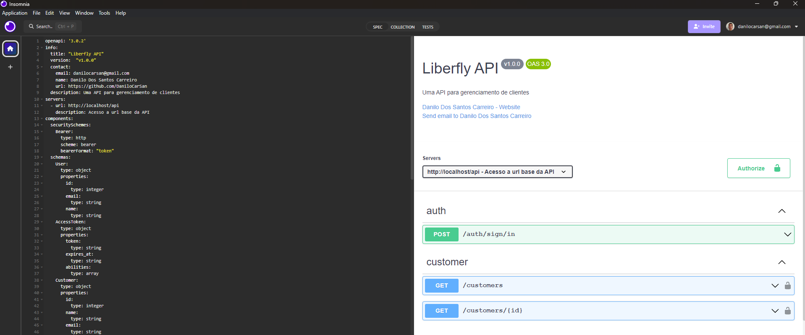

# Liberfy API

## PASTA PRINCIPAIS DO CÓDIGO DESENVOLVIDO

- /app/Business
- /app/Http/Controllers/Api
- openapi.yml
- /docs/api-docs.html
- /tests/Feature
- /tests/Unit

# Pré requisitos para execução do ambiente de teste

- PHP: 8.3
- [Docker] : ^26
- [Composer] : ^2.2

## Técnologias Utilizadas

- Docker/ Docker compose
- PHP: 8.3
- Laravel: 11
- Laravel Sail
- mailpit
- Mysql: 8
- PHPUnit: 11
- OpenApi(swagger)
- Git | Github | Github Actions(CI)

# Executando aplicação (de uma olhada no arquivo Makefile)

**1 - Na raiz do projeto rode o comando abaixo para baixar as dependências do projeto (composer deve estar instalado)**

````
composer install
````

**2 -  Caso tenha o utilizatário make instalado execute o comando abaixo na raiz do projeto**

````
make start
````

ou

````
cp .env.example .env
sed -i 's/DB_HOST=localhost/DB_HOST=mysql/g' .env
php artisan key:generate
./vendor/bin/sail up -d
docker exec -it liberflyapi-laravel.test-1 bash -c "chmod -R 777 ." 
````

**3 - Para configurar o banco(criar tabeles + dados fake) execute o comando abaixo**
````
make migrate
````

ou

````
./vendor/bin/sail artisan migrate:refresh --seed
````

**4 - A aplicação será executada e os seguintes serviços estarão disponíveis, caso tenha duvida visualize o docker-compose arquivo**

````
Aplicação: http://localhost
mysql= http://localhost::3306
mailpit= http://localhost:8025
````

## Executar os testes

````
make test
````

ou 

````
./vendor/bin/sail test
````


## Documentação da api com Openapi

A documentação se encontra na página inicial da aplicação **http://localhost/** ou **./docs/api-docs.html**, quando executada, ou você pode visualizar a espeficificação no arquivo
**openapi.yml** na raiz do projeto.

Para facilitar a visualização ou até mesmo testar você pode estar importando o arquivo dentro do
insomnia ou no vscode com a extenção **42Crunch.vscode-openapi**



## Rotas da API:

- http://localhost/api/auth/sign/in
- http://localhost/api/customers
- http://localhost/api/customers/{id}


# Testar Via Curl

### auth/sign/in

Request 
````bash

curl -X 'POST' \
  'http://localhost/api/auth/sign/in' \
  -H 'accept: application/json' \
  -H 'Content-Type: application/json' \
  -d '{
  "email": "danilocarsan@gmail.com",
  "password": "password",
  "deviceName": "Iphone 14 Pro Max"
}'

````

Response:
````bash
{
  "user": {
    "id": 1,
    "name": "Danilo Santos",
    "email": "danilocarsan@gmail.com"
  },
  "accessToken": {
    "token": "2|G9kqrcWcRfKuxxU9RtT948QZAguGKt6okqLL37CT8c321fe2",
    "expires_at": "2024-10-11T16:05:02.000000Z",
    "abilities": [
      "*"
    ]
  }
}
````

### /customers
Request  (Configurar o token Bearer obtido anteriormente)
````bash

curl -X 'GET' \
  'http://localhost/api/customers?page=1&perPage=10' \
  -H 'accept: */*' \
  -H 'Authorization: Bearer [REPLACE_TOKEN_LOGIN]'
````

Response:
````bash
{
  "current_page": 1,
  "data": [
    {
      "id": 1,
      "name": "Prof. Josue Fritsch",
      "email": "monahan.ron@beatty.com"
    },
    {
      "id": 10,
      "name": "Mrs. Eden Wolf",
      "email": "jakubowski.alva@larson.net"
    }
  ],
  "first_page_url": "http://localhost/api/customers?page=1",
  "from": 1,
  "last_page": 101,
  "last_page_url": "http://localhost/api/customers?page=101",
  "links": [
    {
      "url": null,
      "label": "&laquo; Previous",
      "active": false
    },
    {
      "url": "http://localhost/api/customers?page=1",
      "label": "1",
      "active": true
    },
    {
      "url": "http://localhost/api/customers?page=2",
      "label": "Next &raquo;",
      "active": false
    }
  ],
  "next_page_url": "http://localhost/api/customers?page=2",
  "path": "http://localhost/api/customers",
  "per_page": 10,
  "prev_page_url": null,
  "to": 10,
  "total": 1001
}
````


### /customers/{id}
Request  (Configurar o token Bearer obtido anteriormente)
````bash
curl -X 'GET' \
  'http://localhost/api/customers/1' \
  -H 'accept: application/json' \
  -H 'Authorization: Bearer [REPLACE_TOKEN_LOGIN]'
````

Response:
````bash
{
  "id": 1,
  "name": "Prof. Josue Fritsch",
  "email": "monahan.ron@beatty.com"
}
````

[Docker]: https://docs.docker.com/engine/install/ubuntu/
[Composer]: https://getcomposer.org/download/